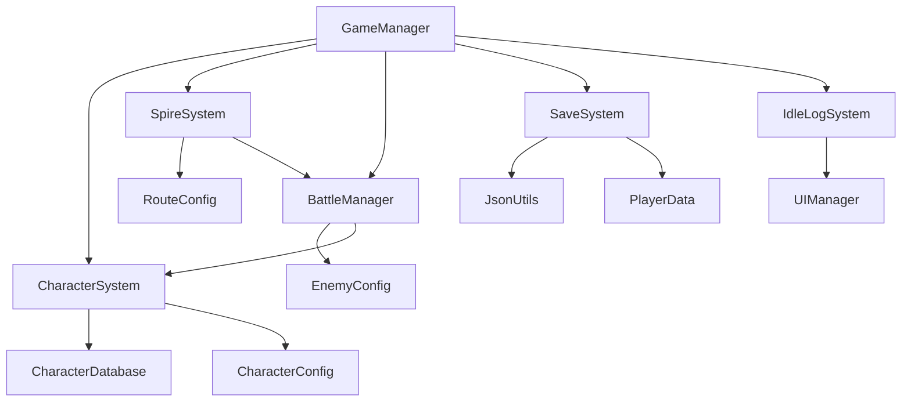

# Idle Battle & Gacha Core Skeleton

[](https://github.com/cleanlii/unity-idlegame-prototype/blob/master/README.md)
[](https://github.com/cleanlii/unity-idlegame-prototype/blob/master/README.zh-sc.md)

A Unity-based idle RPG where players automatically climb towers through different routes, manage characters, and progress through automated systems.

## 🎮 Core Concept

This is an **idle tower climbing game** where players choose from three different routes and progress automatically both online and offline:

- **Battle Route**: Engage in automated 1v1 combat to gain experience and coins
- **Economy Route**: Passively generate coins over time
- **Experience Route**: Passively generate experience points over time

Players can switch routes freely when online, and the game calculates appropriate offline rewards based on the selected route when returning to the game.

---

## 🏗️ Project Structure

```
Assets/Scripts/
├── Core/                          # Core game systems
│   ├── GameManager.cs            # Main game coordinator and entry point
│   ├── BattleManager.cs          # Automated battle system and combat logic
│   ├── PlayerController.cs      # Player movement between routes
│   └── Systems/                  # Specialized game systems
│       ├── CharacterSystem.cs   # Character management and progression
│       ├── SpireSystem.cs       # Route management and switching logic
│       ├── SaveSystem.cs        # Data persistence and encryption
│       ├── IdleLogSystem.cs     # Real-time action logging system
│       ├── EcoSystem.cs         # (Placeholder for economic features)
│       └── GachaSystem.cs       # (Placeholder for gacha mechanics)
├── Data/                         # ScriptableObject configurations
│   ├── PlayerData.cs            # Player progression and statistics
│   ├── CharacterConfig.cs       # Character templates and growth curves
│   ├── CharacterData.cs         # Runtime character instances
│   ├── CharacterDatabase.cs     # Character collection and gacha weights
│   ├── EnemyConfig.cs           # Enemy templates
│   ├── EnemyData.cs             # Runtime enemy instances
│   ├── RouteConfig.cs           # Route reward configurations
│   └── OfflineRewardConfig.cs   # Offline progression settings
├── Utils/                        # Utility and helper classes
│   ├── ServiceLocator.cs        # Dependency injection pattern
│   ├── EventManager.cs          # Type-safe event system
│   ├── JsonUtils.cs             # Encrypted JSON serialization
│   ├── IdleGameConst.cs         # Game constants and file paths
│   └── LogEntryUI.cs            # UI components for log entries
└── UIManager.cs                  # UI coordination and animation
```

---

## 🎯 Core Systems Overview

### **Battle Manager** - Automated Combat System
The `BattleManager` handles all combat logic with automated damage calculation and turn-based mechanics:

**Key Features:**
- **Automated Combat**: Characters and enemies attack at intervals based on attack speed
- **Damage Calculation**: Includes random variance, critical hits, and special abilities
- **Battle Refresh System**: When players die, automatically revive and restart battles
- **Combat Statistics**: Tracks damage dealt/taken, battle count, win streaks

**Combat Flow:**
1. Player attacks enemy → Calculate damage with crits/special abilities
2. Enemy attacks player → Apply damage reduction based on defense
3. Battle continues until one side dies
4. Victory: Grant EXP and coins, restore HP, generate new enemy
5. Defeat: Revive player after delay, reset enemy HP, restart battle

### **Idle Rewards System** - Offline Progression
The game calculates offline rewards based on elapsed time and selected route:

**Offline Calculation Logic:**
- **Route-Based Rewards**: Different routes provide different offline benefits
- **Time Validation**: Anti-cheat measures prevent time manipulation
- **Efficiency Scaling**: Long offline periods have diminishing returns
- **Level Scaling**: Higher level characters generate better offline rewards

**Reward Types:**
- **Battle Route**: Experience (primary) + moderate coins + simulated battles
- **Economy Route**: High coin generation + no experience
- **Experience Route**: High experience generation + no coins

### **Gacha Mechanic** - Character Collection
Characters are defined through ScriptableObjects with weighted rarity system:

**Character System:**
- **CharacterConfig**: Template defining base stats and growth curves
- **CharacterDatabase**: Collection manager with gacha probability weights
- **CharacterData**: Runtime instances with levels, experience, and battle stats
- **Rarity System**: Common (60%), Rare (25%), Epic (12%), Legendary (3%)

**Gacha Features:**
- Weighted random selection based on rarity
- Character progression independent of gacha
- ScriptableObject-based configuration for easy balancing

### **Upgrade System** - Progression Mechanics
Multiple progression paths using a unified currency system:

**Progression Types:**
1. **Battle Experience**: Gained from combat victories
2. **Purchased Experience**: Buy EXP directly with coins
3. **Character Switching**: Manage multiple characters with independent progression
4. **Stat Scaling**: HP, Attack, Defense, Critical Rate grow with levels

**Formula Examples:**
- **HP Growth**: `baseHP + (level-1) × hpGrowthPerLevel × rarityMultiplier`
- **EXP Requirements**: `baseExp × level^growthFactor`
- **Damage Calculation**: `(baseAttack + levelBonus) × randomFactor × critMultiplier`

### **Currency System** - Unified Economy
Single currency (coins) used for all transactions:

**Coin Sources:**
- Battle victories
- Economy route passive generation
- Offline rewards

**Coin Spending:**
- Purchase experience points
- Gacha character pulls
- (Future: Equipment, upgrades, etc.)

### **Logging System** - Action Tracking
Comprehensive logging system for all player actions and game events:

**Log Categories:**
- **Battle**: Damage dealt/taken, battle results, enemy encounters
- **Character**: Level ups, character switches, stat changes
- **Economy**: Coin gains/losses, purchases, rewards
- **System**: Route switches, offline rewards, save/load events
- **Experience**: EXP gains, level progression, skill unlocks

---

## 🔧 Technical Architecture

### **Design Patterns Used**
- **Service Locator**: Centralized system dependency management
- **Observer Pattern**: Event-driven communication between systems
- **ScriptableObject Architecture**: Data-driven design for easy content creation
- **Command Pattern**: UI actions trigger specific game commands

### **Data Flow Architecture**
```
GameManager (Coordinator)
    ├── PlayerData (Persistent State)
    ├── CharacterSystem (Character Management)
    ├── SpireSystem (Route Logic)
    ├── BattleManager (Combat Simulation)
    ├── SaveSystem (Data Persistence)
    └── IdleLogSystem (Action Logging)
```

### **Key Technical Features**

**1. Encrypted Save System**
- Uses AES encryption for save file security
- Automatic backup creation before overwriting saves
- Data validation and corruption recovery

**2. Event-Driven Architecture**
```csharp
public Action<CharacterData> OnCharacterSwitched;
public Action<CharacterData, int> OnCharacterLevelUp;
public Action<long, long> OnCurrencyChanged;
```

**3. Service Locator Pattern**
```csharp
ServiceLocator.Register<CharacterSystem>(characterSystem);
var battleManager = ServiceLocator.Get<BattleManager>();
```

**4. Type-Safe Event System**
```csharp
EventManager.Subscribe<BattleEndEvent>(OnBattleEnd);
EventManager.Publish(new BattleEndEvent { victory = true });
```

---

## 🚀 Getting Started

### **Setup Requirements**
- Unity 2022.3 LTS or later
- Newtonsoft.Json package (for enhanced serialization)
- DOTween (for UI animations)
- TextMeshPro (for UI text rendering)

### **Quick Start Guide**

1. **Configure Character Database**
   - Create character configs in `Assets/Data/Characters/`
   - Set up CharacterDatabase with default character
   - Configure gacha weights for different rarities

2. **Set Up Route Configs**
   - Configure BattleRouteConfig with combat rewards
   - Set EconomyRouteConfig coin generation rates
   - Define ExperienceRouteConfig EXP generation rates

3. **Initialize Game Manager**
   - Drag all system components to GameManager
   - Set auto-save interval and offline reward settings
   - Configure anti-cheat parameters

4. **Test Core Features**
   - Use Context Menu options for testing individual systems
   - Check Unity Console for detailed logging output
   - Monitor IdleLogSystem for real-time action feedback

---

## 🎮 Core Gameplay Loop

### **Active Gameplay (Online)**
```
Player Chooses Route → System Executes Route Logic → Player Gains Rewards
    ↓
Battle Route: Auto-combat → EXP + Coins
Economy Route: Time-based → Coins
Experience Route: Time-based → EXP
    ↓
Player Uses Coins → Buy EXP or Gacha → Character Progression
```

### **Passive Gameplay (Offline)**
```
Game Calculates Offline Time → Apply Route-Based Multipliers → Generate Rewards
    ↓
Battle: Simulate combat sessions for EXP/Coins
Economy: Generate coins based on hourly rate
Experience: Generate EXP based on hourly rate
    ↓
Apply Rewards on Return → Update Character Stats → Continue Progression
```

---

## 🔍 Key Features in Detail

### **Route System**
- **Dynamic Switching**: Change routes anytime with immediate effect
- **Route-Specific Logic**: Each route runs different reward algorithms
- **Progress Persistence**: Route timers and states saved between sessions

### **Character Progression**
- **Multi-Character Support**: Collect and switch between different characters
- **Independent Progression**: Each character levels separately
- **Stat Scaling**: Growth curves defined in ScriptableObjects
- **Battle Statistics**: Track performance metrics per character

### **Anti-Cheat Measures**
- **Time Validation**: Detect system clock manipulation
- **Data Integrity**: Validate save files for corruption or tampering
- **Reasonable Limits**: Cap maximum offline rewards to prevent exploitation

### **Developer-Friendly Features**
- **Context Menu Testing**: Right-click methods for quick testing
- **Comprehensive Logging**: Detailed debug output for all systems
- **Modular Design**: Systems can be tested independently
- **ScriptableObject Workflow**: Easy content creation without code changes

---

## 🛠️ Development Notes

### **Code Style Guidelines**
- **English Comments**: All public APIs documented in English
- **Chinese Debug Output**: Console messages in Chinese for localization
- **Consistent Naming**: Clear, descriptive method and variable names
- **Error Handling**: Comprehensive try-catch blocks with meaningful error messages

### **Performance Considerations**
- **Cached Calculations**: Character stats cached until level changes
- **Coroutine Management**: Proper cleanup to prevent memory leaks
- **UI Update Optimization**: Throttled updates (every 0.5 seconds)
- **Memory Management**: Object pooling for frequent instantiations

### **Testing Framework**
Each major system includes Context Menu testing methods:
- `[ContextMenu("Test Battle Victory")]`
- `[ContextMenu("Test Character Switch")]`
- `[ContextMenu("Test Offline Rewards")]`

### **Future Expansion Points**
- **Equipment System**: Extend character progression
- **Skill Trees**: Add character specialization
- **Guild Features**: Social elements and cooperative gameplay
- **Event System**: Time-limited challenges and rewards

---

## 📊 System Dependencies



This architecture ensures clean separation of concerns while maintaining efficient communication between systems through the Service Locator pattern and event-driven design.