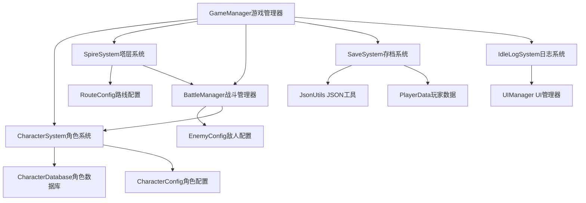

# 放置类小游戏原型Demo

[](https://github.com/cleanlii/unity-idlegame-prototype/blob/master/README.md)
[](https://github.com/cleanlii/unity-idlegame-prototype/blob/master/README.zh-sc.md)

基于Unity开发的挂机RPG游戏，玩家通过不同路线自动爬塔，管理角色，并通过自动化系统进行游戏进度。

## 🎮 核心概念

这是一款**挂机自动爬塔游戏**，玩家可以从三条不同的路线中选择，在线和离线时都能自动推进游戏进度：

- **战斗线路**: 进行自动化1v1战斗，获得经验值和金币
- **经济线路**: 随时间被动产生金币收益
- **经验线路**: 随时间被动产生经验值收益

玩家在线时可以自由切换路线，离线时游戏会根据选择的路线计算相应的离线奖励。

---

## 🏗️ 项目结构

```
Assets/Scripts/
├── Core/                          # 核心游戏系统
│   ├── GameManager.cs            # 主游戏协调器和入口点
│   ├── BattleManager.cs          # 自动战斗系统和战斗逻辑
│   ├── PlayerController.cs      # 玩家在路线间的移动
│   └── Systems/                  # 专业化游戏系统
│       ├── CharacterSystem.cs   # 角色管理和进度系统
│       ├── SpireSystem.cs       # 路线管理和切换逻辑
│       ├── SaveSystem.cs        # 数据持久化和加密
│       ├── IdleLogSystem.cs     # 实时行为日志系统
│       ├── EcoSystem.cs         # （经济功能占位符）
│       └── GachaSystem.cs       # （抽卡机制占位符）
├── Data/                         # ScriptableObject配置文件
│   ├── PlayerData.cs            # 玩家进度和统计数据
│   ├── CharacterConfig.cs       # 角色模板和成长曲线
│   ├── CharacterData.cs         # 运行时角色实例
│   ├── CharacterDatabase.cs     # 角色收藏和抽卡权重
│   ├── EnemyConfig.cs           # 敌人模板
│   ├── EnemyData.cs             # 运行时敌人实例
│   ├── RouteConfig.cs           # 路线奖励配置
│   └── OfflineRewardConfig.cs   # 离线进度设置
├── Utils/                        # 工具和辅助类
│   ├── ServiceLocator.cs        # 依赖注入模式
│   ├── EventManager.cs          # 类型安全事件系统
│   ├── JsonUtils.cs             # 加密JSON序列化
│   ├── IdleGameConst.cs         # 游戏常量和文件路径
│   └── LogEntryUI.cs            # 日志条目UI组件
└── UIManager.cs                  # UI协调和动画管理
```

---

## 🎯 核心系统详解

### **战斗管理器** - 自动化战斗系统
`BattleManager` 处理所有战斗逻辑，包含自动伤害计算和回合制机制：

**核心功能：**
- **自动化战斗**: 角色和敌人根据攻击速度定时攻击
- **伤害计算**: 包含随机波动、暴击和特殊技能
- **战斗刷新系统**: 玩家死亡后自动复活并重启战斗
- **战斗统计**: 追踪造成/承受伤害、战斗次数、连胜记录

**战斗流程：**
1. 玩家攻击敌人 → 计算伤害（含暴击/特殊技能）
2. 敌人攻击玩家 → 根据防御力减少伤害
3. 战斗持续直到一方死亡
4. 胜利：给予经验和金币，恢复HP，生成新敌人
5. 失败：延迟后复活玩家，重置敌人HP，重启战斗

### **挂机奖励系统** - 离线进度
游戏根据离线时间和选择的路线计算离线奖励：

**离线计算逻辑：**
- **基于路线的奖励**: 不同路线提供不同的离线收益
- **时间验证**: 防作弊措施防止时间操控
- **效率递减**: 长时间离线有收益递减机制
- **等级加成**: 高等级角色产生更好的离线奖励

**奖励类型：**
- **战斗线路**: 经验（主要）+ 适量金币 + 模拟战斗
- **经济线路**: 高金币产出 + 无经验
- **经验线路**: 高经验产出 + 无金币

### **抽卡机制** - 角色收集
角色通过ScriptableObject定义，具有基于权重的稀有度系统：

**角色系统：**
- **CharacterConfig**: 定义基础属性和成长曲线的模板
- **CharacterDatabase**: 角色收藏管理器，包含抽卡概率权重
- **CharacterData**: 具有等级、经验和战斗统计的运行时实例
- **稀有度系统**: 普通(60%)、稀有(25%)、史诗(12%)、传说(3%)

**抽卡特色：**
- 基于稀有度的权重随机选择
- 角色进度独立于抽卡系统
- 基于ScriptableObject的配置便于平衡调整

### **升级系统** - 进度机制
使用统一货币系统的多种进度路径：

**进度类型：**
1. **战斗经验**: 从战斗胜利中获得
2. **购买经验**: 直接用金币购买经验值
3. **角色切换**: 管理多个具有独立进度的角色
4. **属性成长**: HP、攻击力、防御力、暴击率随等级增长

**公式示例：**
- **HP成长**: `基础HP + (等级-1) × HP成长值 × 稀有度倍率`
- **经验需求**: `基础经验 × 等级^成长因子`
- **伤害计算**: `(基础攻击 + 等级加成) × 随机因子 × 暴击倍率`

### **货币系统** - 统一经济
单一货币（金币）用于所有交易：

**金币来源：**
- 战斗胜利
- 经济路线被动产出
- 离线奖励

**金币用途：**
- 购买经验点数
- 抽卡获得角色
- （未来：装备、升级等）

### **日志系统** - 行为追踪
全面的日志系统记录所有玩家行为和游戏事件：

**日志分类：**
- **战斗**: 造成/承受伤害、战斗结果、敌人遭遇
- **角色**: 升级、角色切换、属性变化
- **经济**: 金币收入/支出、购买、奖励
- **系统**: 路线切换、离线奖励、存读档事件
- **经验**: 经验获得、等级进度、技能解锁

---

## 🔧 技术架构

### **使用的设计模式**
- **服务定位器**: 集中式系统依赖管理
- **观察者模式**: 系统间事件驱动通信
- **ScriptableObject架构**: 数据驱动设计便于内容创建
- **命令模式**: UI操作触发特定游戏命令

### **数据流架构**
```
GameManager (协调器)
    ├── PlayerData (持久化状态)
    ├── CharacterSystem (角色管理)
    ├── SpireSystem (路线逻辑)
    ├── BattleManager (战斗模拟)
    ├── SaveSystem (数据持久化)
    └── IdleLogSystem (行为日志)
```

### **关键技术特性**

**1. 加密存档系统**
- 使用AES加密保护存档文件安全
- 覆盖存档前自动创建备份
- 数据验证和损坏恢复机制

**2. 事件驱动架构**
```csharp
public Action<CharacterData> OnCharacterSwitched;
public Action<CharacterData, int> OnCharacterLevelUp;
public Action<long, long> OnCurrencyChanged;
```

**3. 服务定位器模式**
```csharp
ServiceLocator.Register<CharacterSystem>(characterSystem);
var battleManager = ServiceLocator.Get<BattleManager>();
```

**4. 类型安全事件系统**
```csharp
EventManager.Subscribe<BattleEndEvent>(OnBattleEnd);
EventManager.Publish(new BattleEndEvent { victory = true });
```

---

## 🚀 开始使用

### **环境要求**
- Unity 2022.3 LTS或更高版本
- Newtonsoft.Json包（用于增强序列化）
- DOTween（用于UI动画）
- TextMeshPro（用于UI文本渲染）

### **快速开始指南**

1. **配置角色数据库**
   - 在`Assets/Data/Characters/`中创建角色配置
   - 设置包含默认角色的CharacterDatabase
   - 配置不同稀有度的抽卡权重

2. **设置路线配置**
   - 配置BattleRouteConfig的战斗奖励
   - 设置EconomyRouteConfig的金币产出率
   - 定义ExperienceRouteConfig的经验产出率

3. **初始化游戏管理器**
   - 将所有系统组件拖拽到GameManager
   - 设置自动保存间隔和离线奖励设置
   - 配置防作弊参数

4. **测试核心功能**
   - 使用Context Menu选项测试各个系统
   - 检查Unity控制台的详细日志输出
   - 监控IdleLogSystem的实时行为反馈

---

## 🎮 核心游戏循环

### **主动游戏（在线）**
```
玩家选择路线 → 系统执行路线逻辑 → 玩家获得奖励
    ↓
战斗路线: 自动战斗 → 经验 + 金币
经济路线: 基于时间 → 金币
经验路线: 基于时间 → 经验
    ↓
玩家使用金币 → 购买经验或抽卡 → 角色进度
```

### **被动游戏（离线）**
```
游戏计算离线时间 → 应用基于路线的倍率 → 生成奖励
    ↓
战斗: 模拟战斗会话获得经验/金币
经济: 基于小时费率生成金币
经验: 基于小时费率生成经验
    ↓
返回时应用奖励 → 更新角色属性 → 继续进度
```

---

## 🔍 核心功能详解

### **路线系统**
- **动态切换**: 随时更改路线并立即生效
- **路线专属逻辑**: 每条路线运行不同的奖励算法
- **进度持久化**: 路线计时器和状态在会话间保存

### **角色进度系统**
- **多角色支持**: 收集并在不同角色间切换
- **独立进度**: 每个角色单独升级
- **属性成长**: 在ScriptableObject中定义成长曲线
- **战斗统计**: 追踪每个角色的表现指标

### **防作弊措施**
- **时间验证**: 检测系统时钟操控
- **数据完整性**: 验证存档文件是否损坏或被篡改
- **合理限制**: 设置最大离线奖励上限防止利用

### **开发者友好特性**
- **Context Menu测试**: 右键点击方法进行快速测试
- **全面日志**: 所有系统的详细调试输出
- **模块化设计**: 系统可以独立测试
- **ScriptableObject工作流**: 无需修改代码即可轻松创建内容

---

## 🛠️ 开发说明

### **代码风格指南**
- **英文注释**: 所有公共API用英文文档化
- **中文调试输出**: 控制台消息使用中文便于本地化
- **一致命名**: 清晰、描述性的方法和变量名
- **错误处理**: 全面的try-catch块，提供有意义的错误信息

### **性能考虑**
- **缓存计算**: 角色属性在等级变化前缓存
- **协程管理**: 适当清理防止内存泄漏
- **UI更新优化**: 限制更新频率（每0.5秒）
- **内存管理**: 频繁实例化使用对象池

### **测试框架**
每个主要系统都包含Context Menu测试方法：
- `[ContextMenu("测试战斗胜利")]`
- `[ContextMenu("测试角色切换")]`
- `[ContextMenu("测试离线奖励")]`

### **未来扩展点**
- **装备系统**: 扩展角色进度
- **技能树**: 添加角色专精
- **公会功能**: 社交元素和合作游戏
- **活动系统**: 限时挑战和奖励

---

## 📊 系统依赖关系



这种架构确保了清晰的关注点分离，同时通过服务定位器模式和事件驱动设计保持系统间的高效通信。

---

## 🎯 核心游戏机制详解

### **三路线系统**
- **战斗线**: 自动1v1战斗，平衡经验和金币收益
- **金币线**: 纯经济收益，适合需要大量金币时使用
- **经验线**: 纯经验收益，适合快速升级时使用

### **角色成长体系**
- **多维属性**: HP、攻击、防御、暴击率、攻击速度
- **稀有度系统**: 不同稀有度角色有不同的属性倍率
- **成长曲线**: 每个角色有独特的升级公式
- **特殊技能**: 部分角色拥有特殊能力和额外伤害

### **敌人系统**
- **动态生成**: 根据玩家等级生成适合的敌人
- **类型分类**: 普通、精英、Boss、特殊四种敌人类型
- **属性调整**: 不同类型敌人有不同的属性加成和奖励倍率
- **随机性**: 每个敌人都有±10%的属性随机波动

### **离线奖励机制**
- **时间检测**: 通过`DateTime.Now`和`lastSaveTime`计算离线时长
- **防作弊**: 检测系统时间倒退和异常离线时长
- **效率递减**: 
  - 1小时内：100%效率
  - 6小时内：90%效率
  - 12小时内：80%效率
  - 24小时内：70%效率
  - 超过24小时：50%效率